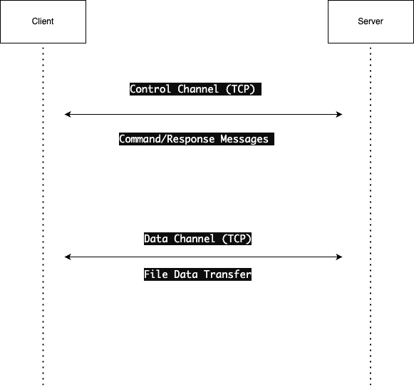

Project Name: TCP Client-Server File Transfer

Description:
This project implements a client-server architecture for transferring files over socket. It consists of two components: a client and a server, which communicate over a control channel and a data channel.

Students:

- Junhao Guo, Jguo1@csu.fullerton.edu
- Nhi Danis, 
- Alvaro Samayoa
- Peter West
- Steven Delgado

Programming Language:
Python

Execution Instructions:

1. **Run the Server**: Execute the server code in one terminal window. This will start the FTP server and make it ready to accept connections from clients.

   ```bash
   python ftp_server.py
   ```

2. **Run the Client**: Execute the client code in another terminal window. This will connect to the server and allow you to interact with it.

   ```bash
   python ftp_client.py
   ```

3. **Interact with the Client**: In the client terminal, you'll see the prompt `ftp>`. Here, you can type various commands such as `ls`, `get <filename>`, `put <filename>`, and `quit`.

   - To list files on the server: Type `ls` and press Enter.
   - To download a file from the server: Type `get <filename>` and press Enter.
   - To upload a file to the server: Type `put <filename>` and press Enter.
   - To quit the FTP session: Type `quit` and press Enter.

4. **Verify the Results**: After executing the desired commands, verify that the files are transferred correctly between the server and the client.

5. **Exit the Client and Server**: Once you're done testing, exit the client and server by typing `quit` in the client terminal and pressing Enter. Then, press `Ctrl + C` in the server terminal to stop the server.

Special Notes:

- The project utilizes TCP/IP socket for communication.
- The control channel is used for sending command/response messages.
- The data channel is used for transferring file data.
- Ensure that both client and server are running on compatible systems with network connectivity.

Diagram:

